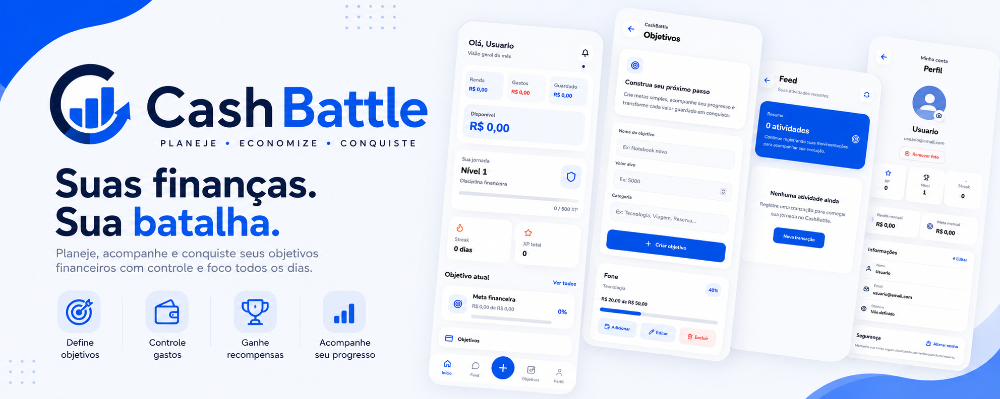

---

## Sobre

O **CashBattle** é uma plataforma de educação financeira que transforma o gerenciamento do dinheiro em uma experiência mais simples, motivadora e envolvente.

A aplicação incentiva o desenvolvimento de hábitos financeiros por meio de recursos de gamificação, permitindo acompanhar despesas, definir objetivos, registrar conquistas e visualizar a evolução financeira de forma intuitiva.

---

## Funcionalidades

* Gestão financeira pessoal
* Controle de receitas e despesas
* Metas financeiras
* Feed de atividades
* Sistema de níveis (XP)
* Desafios e conquistas
* Perfil do usuário
* Dashboard financeiro
* Estatísticas e progresso

---

## Tecnologias

### Front-end

* React
* React Router
* CSS
* Axios

### Back-end

* Node.js
* Express
* JWT

### Banco de Dados

* PostgreSQL

---

## Status

O projeto encontra-se em desenvolvimento e novas funcionalidades serão adicionadas continuamente.

---

## Roadmap

### Concluído

* [x] Sistema de autenticação
* [x] Dashboard inicial
* [x] Perfil do usuário
* [x] Metas financeiras
* [x] Feed de atividades

### Em desenvolvimento

* [ ] Ranking global
* [ ] Desafios semanais
* [ ] Conquistas
* [ ] Relatórios financeiros
* [ ] Aplicativo Mobile

---

**AxioDevStudio**

© 2026 AxioDevStudio · Open Source Organization

